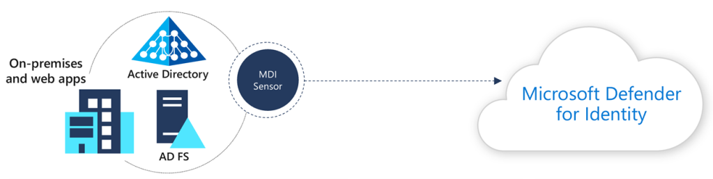
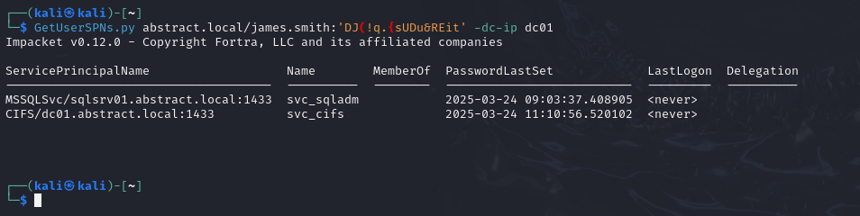
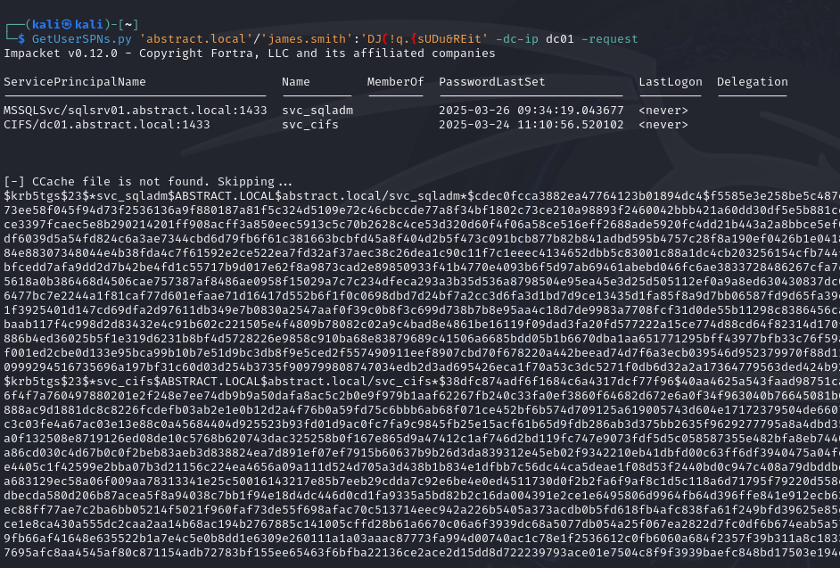
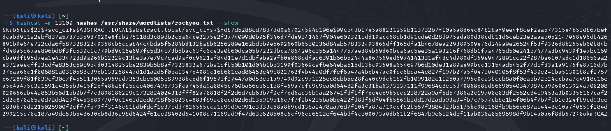

## Hook

More than 80% of modern breaches involve identity misuse. Attackers no longer "hack in"—they log in. In today’s threat landscape, Active Directory (AD) is the crown jewel. Once compromised, it's game over for most environments.

Picture this: a red team lands on a workstation, pivots silently through the network, dumps hashes, and executes a DCSync. But behind the scenes, Microsoft Defender for Identity (MDI) is lighting up with correlated alerts, mapping the attack from recon to domain dominance.

Identity is the modern battleground—and MDI is your radar.

## What is Microsoft Defender for Identity

Microsoft Defender for Identity (formerly Azure ATP) is a cloud-based security solution that monitors preemption Active Directory signals to identify and detect advanced threats, compromised identities, and malicious insider actions.

For Red Teamers: MDI is the tripwire that will catch you snooping around AD. It's designed to detect recon, lateral movement, and abuse of credentials.

For Blue Teamers: MDI is your X-ray vision into identity-related threats. It provides deep insights into what users and systems are doing, maps out attack paths, and integrates natively with Microsoft 365 Defender and Sentinel.

With tight MITRE ATT&CK mapping and real-time alerts, MDI shines when identity becomes the attack vector.

## The Attackers Journey (Red Team POV)

Let’s walk through a realistic kill chain:

### Initial access & Recon

Imagine scenario where, we as attackers, got initial access which is standard domain user account. Next thing which will any attacker do is enumeration of users, groups and etc. Let's say James' account is compromised, now attacker will enumerate all SPN accounts.

Two SPN accounts are presented in the domain. Next, attacker will obtain TGS tickets for all of these accounts and attempts to crack them offline.

These TGS attacker can try to crack using hashcat and rockyou.txt wordlist.

`svc_cifs` is found to be using a weak password.

